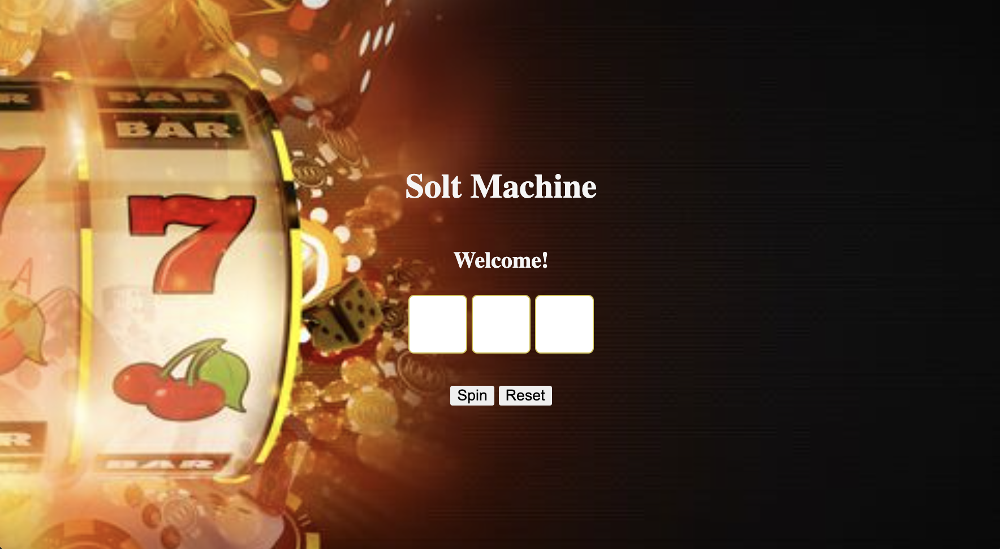
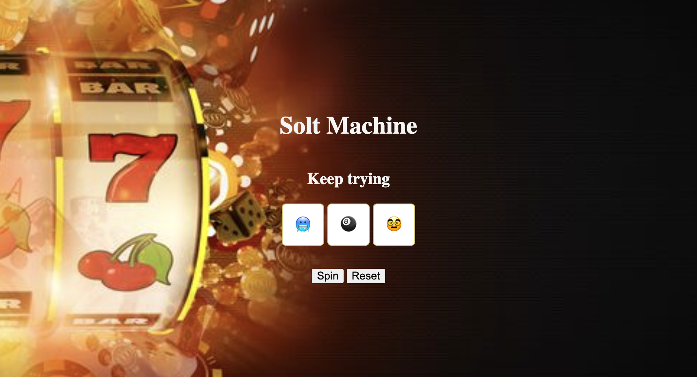

# Slot Machine 
It is a clasic casino game "Slot Machine". I've used HTML, CSS, and JavaScript for this project. Also I've added some emojis to make game interesting.
You can play the game here ~ <a href="https://zianggu.github.io/slotmachine724/"> (Hope you like it)
------
## Rules -
Game Rules Slot Machine is a popular game that is simply to play. In order to win the game, 3 identical symbols must match in the middle row.

## Screenshots -
- Let's spin.
</img>

- You Win.
</img>

- Keep Trying.
</img>

- Add Emojies.
</img>

## Next Steps -
As you can see, this is the first game I have written from scratch without any prior coding experience, and it will also serve as a starting point. The next step will be to enhance my understanding of pseudocode from various functions, and based on that understanding, incorporate it into this game or other games. 

